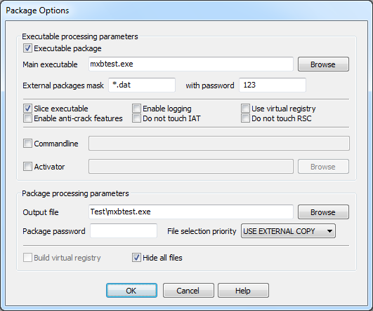
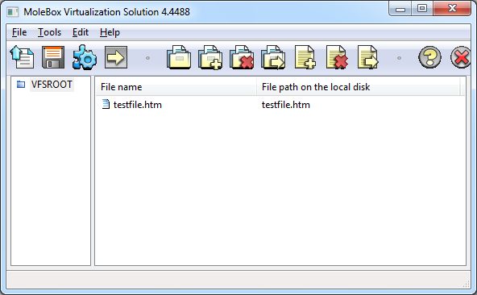

# Overview

**MoleBox Virtualization Solution** (_MoleBox VS_) creates application-specific and secure virtual environment for your software applications, isolating them from the underlaying operating system and other software installed and running on the host device. It is achieved by placing the application and all of its elements into managed packages which form the following virtual layers in runtime:

>**Virtual file system**: provides the application with transparent access to original files while protecting them from unauthorized use

>**Virtual registry**: allows using ActiveX components without registration and overriding existing registry values while protecting the host registry from modifications

**Create virtual environment for your software**

_MoleBox VS_ lets you convert your application into an all-sufficient stand-alone executable, containing everything needed: components, media assets, registry entries and runtime settings. Moleboxed environment is private and secure, which means that all packaged elements are available to your application only and are protected from any unauthorized access.

**Create portable applications**

Traditional software setup process frequently requires administrator privileges, includes installation and registration of many components, and may take significant time. Portable moleboxed applications run without installation on any computer, from any source - USB device, CD-ROM, or network drive. Moleboxed software can run without altering host device file system: it does not extract original files not creates temporary files, and can be easily and cleanly removed when necessary.

**Use any components and runtimes without installation or registration**
_MoleBox VS_ allows embedding DLLs, ActiveX and .NET components, as well as VB, Fox Pro, Java and other runtimes into your application. Embedded components are loaded on demand directly to the memory and are never extracted to disk. Due to virtual registry technology, you can use ActiveX components without registration, without any changes to the host PC registry.

**Run from user level, without administrator privileges**

Moleboxed applications require neither installation no modifications to the host device registry, and run in user mode, without administrator privileges. Your end-users won't be discouraged with security warnings or any other problems running your software.

**Avoid application conflicts, DLL hell and registry root**

With _MoleBox VS_ you can create zero-install applications which are isolated from the host device, protecting it against changes to environment, registry and file system. This allows using multiple versions of same applications, components and runtimes at the same time without conflicts.

**Manage your software distribution, simplify delivery, reduce support and testing cost**

Moleboxed applications can be delivered in a single executable that runs with zero setup. _MoleBox VS_ allows easy creation and distribution of software updates, by creating additional packages and delivering them to end-users.

MoleBox virtualization technology eliminates the need to test software on different configurations. Software developers and IT managers may package software once and deploy to different operating systems without repackaging.

_Despite its outstanding functionality, MoleBox is very easy to use: you don't need to deal with complicated settings, create installation programs or make system snapshots. All you need is to pick out the files required by your application and pack them._

# Features

**Virtual file system features**

+ **Placing entire application into managed packages**. With _MoleBox VS_, you can package entire application suite into a single executable file, or create additional managed packages if necessary. Packed application keeps the functionality of the original program and runs without extracting packed files to the hard drive or creating temporary files in runtime.

+ **Packaging multiple executable files together**. With _MoleBox VS_, you can embed additional executable files into your application, thus hiding them from access and creating stand-alone executable file.

+ **Embedding components and runtimes into executable**. _MoleBox VS_ lets you embed DLLs, ActiveX and .NET components, VB, FoxPro, Java and other runtimes into application. Integrated components and runtimes are loaded on demand directly to memory, without installing or extracting any files.

+ **Avoiding DLL hell and version conflicts**. By embedding DLLs and ActiveX components into the EXE file, MoleBox makes sure that your application will always uses the same DLL versions it was compiled with. No 3rd party program can harm your app's functionality, and vice versa.

+ **Compression and encryption for binary and data files**. MoleBox can compress and encrypt packed files, decreasing overall application size and protecting file from unauthorized use.

**Virtual registry features**

+ **Using ActiveX components without registration**. With _MoleBox VS_ you can use any ActiveX components without any changes to the host device registry, which lets your users run packed application without administrator privileges, and helps to prevent registry rot. This also helps isolate your application and protecting it from unwanted modifications.

+ **Virtual registry keys**. _MoleBox VS_ lets you create temporary registry keys or modify existing virtual registry keys in runtime, without affecting the real registry.

**Virtual environment features**

+ **Embedded command line parameters**. If your application accepts calling parameters, you can also integrate them into the main executable. With this technique, it's possible to create multiple versions of the same program without changing a line of code.

+ **Command line modifications**. Through Molebox API, you can modify calling parameters of the packed application.

**Deployment features**

+ **One-time packaging**. Once packaged, a moleboxed application can be delivered to many operating systems. You don't have to repackage, unless you use components that can run differently on 32bit and 64bit operating systems.

+ **Sharing data packages between different packed applications**. Data packages made with _MoleBox VS_ are independent from executable files. You can use the same package with different executables provided that you set proper parameters while generating executable packages.

+ **Compatibility with 3rd party packers and protectors**. Moleboxed application may be wrapped with another wrapper (certain settings required).

# System Requirements

_MoleBox VS_ processes native 32bit and .NET applications 2.x+ and supports Windows 2000/XP/Vista/7/8/10 operating systems. It is compatible with a wide range of software development tools.

# How To Package Your Application

MoleBox processes software applications by placing them into one or more managed packages. Each package contains a virtual file system including some files of your application suite, and may also contain virtual registry entries. In the simplest case, you can put all application files into a single EXE file.

If a package contains the main EXE file of your application, it's called executable package and it should be compiled into an EXE file. Other packages are compiled into files with extensions of your choice.

When an executable package starts, it can mount other packages and use files they contain. Packages are mounted by file name pattern (mask), in alphabetical order.

Projects are stored in MXB files. You need to create a separate project for each package.

You can create packages through [MoleBox GUI](#creating-packages-through-gui) or through [command line interface](#cli). Please note that some advanced features are not available through GUI.

# Creating Packages Through GUI

To create a moleboxed package, follow these steps:

+ [Set package options](#setting-package-options)
+ [Add files](#adding-files)
+ [Compile package](#compiling-the-package)

Please note that some advanced options are not available for editing through GUI, but if any of them present in your project file, MoleBox will spare them.

# Setting Package Options

In the **Tools** menu, select Options..., or click Package Options... button in the toolbar. Package Options window opens.



# Adding Files

The main window displays contents of the current package in a tree view and allows you to modify it.



**File name** column displays short name used to access the file from the packed application(short virtual path), **File path on the local disk** shows the name of the source file relative to the project file location.

Use toolbar buttons or **Edit** menu items to fill and modify the package contents. You can either add entire folders or separate files. If you add a folder, its subfolders are recursively added as well. Additionally, you can create virtual folders – folders inside the package, which allows building directory structure different from the one on the hard drive. You may also assign a different name (alias) to a packed file by renaming it.

# Important notice on virtual paths

Virtual path (file name alias; file name used by the packed application to access the file) always starts from **VFSROOT** (_virtual file system root folder_). In the simplest and case, virtual path can be the same as the real path.

For example, your application consists of the main executable **\bin\main.exe** and a sound file **\music\track1.ogg**. In the original application, the path to the music file would be **..\music\track1.ogg**. When creating a data package, you may add **track1.ogg** to the main directory, **VFSROOT**, and then the virtual path would be **track1.ogg**. Or you can create a folder **music** under **VFSROOT**, so the virtual path would be **music\track1.ogg**.

# Compiling the Package

At this point your configuration is ready for packaging.

To start packaging:

+ in the **Tools** menu, select Pack... or click Pack button in the toolbar;
+ **Packing** window opens and displays packing progress;
+ when processing of an executable package is finished, you can click **Execute** a test button to check your application.

# Creating Packages Through Command Line

You can also create packages using command line packaging tool, **mxbpack.exe**. This tool allows generating packages either using project files created earlier (learn more about [project file syntax](#)) or without project files, specifying a list of files to pack directly in the command line.

**Command line tool has the following syntax**:
```
using: mxbpack.exe [options] ~~ @<mxbconf.mxb>
using: mxbpack.exe [options] ~~ -o external.dat [[!/#/*][~0/1/2/*]file[;pack_as]]
using: mxbpack.exe [options] <pefile.exe> [-o out.exe] [[!/#/*][~0/1/2/*]file[;pack_as]]
```

**Returned value**:
+ 0 - success,
+ non-zero value - error.

**Parameters**:

Parameter |Meaning
 --- | ---
\<pefile.exe\> |Main executable for executable packages; '~~' for non-executable packages or when using an existing project file
\<out.exe\> |Output file name.
@\<mxbconf.mxb\> |Existing project file.
file | files to add to the package.

**The following options are available**:

Option |Meaning
 --- | ---
  -V               |  print program version and exit
  -?               |  print option's help and exit
  -o \<outputfile\>  |  new name for package or wrapped file
  -B               |  blindly auto-bundle all non-system dependencies
  -l               |  enable virtualization logging
  -O               |  build/use virtual registry
  -H               |  hide all files
  -C \<0/1/2\>       |  if file named like embedded exists on a disk: 0=>use embedded, 1=>use external, 2=>access error
  -D \<envar\>=\<val\> |  define environment variable
  -e/-a \<dllname\>  |  '-e' embed activator dll or '-a' use external one
  -c \<cmdl-args\>   |  override commandline arguments
  -F               |  do not encrypt executable extradata
  -z               |  slice executable and store inaccessible via VFS
  -s               |  opposite to -z, store original EXE as-is in default package
  -S \<container\>   |  use defined container instead original executable
  -q               |  don't touch import table (required for some theme hacks)
  -Q               |  don't touch RSRC section
  -p \<password\>    |  current package password
  -P \<password\>    |  externally mounted packages password
  -m \<filemask\>    |  externally mounted packages mask
  --usereg         |  virtualize registry but not build it
  --regfull        |  virtualize registry totally
  --inject         |  inject virtual environment to child external process
  --regmask \*.reg  |  file mask to import registery files on start
  --company "name" |  company name to add into version resourcses
  --autoreg \<opt\>  | none, onstart, onpack. The onpack selected by default
  --tls \<size\>     | minimal size of tls area in (bytes)
  --image \<size\>   | minimal size of executable image mapping (kilobytes)

Options set via command line override the same options from the configuration file.

(*) What does _auto-bundle all non-system dependencies_ option do? MoleBox recursively adds to the packaging all non-system dependencies of the application; only those that are normally visible with Dependency Walker will be added. The list of added dependencies is displayed in the packaging log. System dependencies should be embedded explicitly.

Files list includes absolute or relative file names, and may also include file aliases.

**Examples**

Processing an existing configuration, either executable or non-executable package, without modifications:
````
mxbpack.exe ~~ @mxbconf.mxb
````

Integrating 2 DLLs into an EXE file:
```
mxbpack.exe program.exe -o packed.exe libs\lib1.dll;lib1.dll libs\lib2.dll;lib2.dll
```

# Creating Patches and Updates

Moleboxed application can mount multiple packages in certain, alphabetical order. Files from packages loaded later replace files with same names loaded earlier. This ability can be used to create and distribute updates to your software. All you need is to create a new package and distribute it to your users.

To create a patch or update:

+ Launch MoleBox and create a new project.
+ Set the package name to a string 'greater' than already existing packages have. Make sure that package file name fits naming pattern specified in the executable package. For example, to replace a file in the package named "sounds1.dat", you can create a new package named "sounds2.dat" (entire file names, including name extensions, are compared).
+ Set the appropriate package password and other options.
+ Add the files which are new or being replaced into this package. If you're replacing files, their names in package should match the previously used names.
+ Compile this package, and it's ready for distribution.

If you need to replace the main executable, you have to rebuild and re-distribute the executable package with the options used before.
